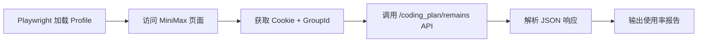

# 读取 MiniMax Usage 工具

> 基于 xhs-scraper 的 Playwright 模式，使用现有 Chrome Profile 获取 MiniMax 额度 API 数据。

---

## 1. 关键发现

MiniMax 有专用 API 接口可直接获取 Coding Plan 使用额度：

```
GET https://www.minimaxi.com/v1/api/openplatform/coding_plan/remains?GroupId={GroupId}
```

**响应示例**:
```json
{
    "model_remains": [
        {
            "start_time": 1767924000000,
            "end_time": 1767942000000,
            "remains_time": 4185323,
            "current_interval_total_count": 1500,
            "current_interval_usage_count": 843,
            "model_name": "MiniMax-M2"
        }
    ],
    "base_resp": {
        "status_code": 0,
        "status_msg": "success"
    }
}
```

**关键字段**:
- `current_interval_total_count`: 总额度
- `current_interval_usage_count`: 已使用
- `remains_time`: 在这个时间后重置
- `model_name`: 模型名称
- `start_time`: 重置时间段的开始
- `end_time`: 重置时间段的结束

---

## 2. 技术架构



---

## 3. 工具代码

```python
# minimax_usage.py - 读取 MiniMax 使用额度（API 方案）
"""
使用 Playwright 获取登录 Cookie，然后调用 MiniMax API 获取精确的使用额度数据。

使用方法:
    python minimax_usage.py          # 获取 usage
    python minimax_usage.py --login  # 先登录
"""

from playwright.sync_api import sync_playwright
from pathlib import Path
import json
import time
import re
import sys
from datetime import datetime

# 复用 xhs-scraper 的 Profile
BASE_DIR = Path(__file__).parent
PROFILE_DIR = BASE_DIR / "xhs-scraper" / "profile"

# MiniMax URLs
MINIMAX_PAGE_URL = "https://platform.minimaxi.com/user-center/payment/coding-plan"
MINIMAX_LOGIN_URL = "https://platform.minimaxi.com/login"
MINIMAX_API_URL = "https://www.minimaxi.com/v1/api/openplatform/coding_plan/remains"

BROWSER_CONFIG = {
    "headless": False,
    "slow_mo": 500,
    "viewport": {"width": 1280, "height": 900},
    "args": [
        "--disable-blink-features=AutomationControlled",
        "--no-sandbox"
    ]
}


def check_login(page) -> bool:
    """检查是否已登录（通过 URL 判断是否跳转到登录页）"""
    current_url = page.url
    if "login" in current_url.lower():
        return False
    return True


def do_login():
    """手动登录 MiniMax"""
    print("=" * 50)
    print("MiniMax 登录模块")
    print("=" * 50)
    print(f"Profile 目录: {PROFILE_DIR}")
    print()
    
    with sync_playwright() as p:
        context = p.chromium.launch_persistent_context(
            user_data_dir=str(PROFILE_DIR),
            headless=False,  # 登录必须可视化
            slow_mo=BROWSER_CONFIG["slow_mo"],
            viewport=BROWSER_CONFIG["viewport"],
            args=BROWSER_CONFIG["args"]
        )
        
        page = context.pages[0] if context.pages else context.new_page()
        
        print("正在打开 MiniMax 登录页...")
        page.goto(MINIMAX_LOGIN_URL, timeout=60000)
        
        print()
        print("=" * 50)
        print("请在浏览器中手动登录 MiniMax：")
        print("1. 使用手机号/邮箱登录")
        print("2. 完成验证码（如有）")
        print("3. 确认登录成功后，回到此窗口按 Enter")
        print("=" * 50)
        print()
        
        input("登录完成后按 Enter 保存会话...")
        
        # 验证登录成功
        page.goto(MINIMAX_PAGE_URL, timeout=60000)
        page.wait_for_load_state("networkidle")
        
        if check_login(page):
            print("✅ 登录成功！")
        else:
            print("⚠️ 登录可能未成功，请重试")
        
        context.close()
        print(f"登录状态已保存至: {PROFILE_DIR}")


def get_minimax_usage():
    """通过 API 获取 MiniMax Coding Plan 使用额度"""
    
    print("=" * 50)
    print("MiniMax Usage 读取工具 (API 版)")
    print("=" * 50)
    
    result = {
        "timestamp": datetime.now().isoformat(),
        "usage": None,
        "percentage": None
    }
    
    with sync_playwright() as p:
        context = p.chromium.launch_persistent_context(
            user_data_dir=str(PROFILE_DIR),
            headless=BROWSER_CONFIG["headless"],
            slow_mo=BROWSER_CONFIG["slow_mo"],
            viewport=BROWSER_CONFIG["viewport"],
            args=BROWSER_CONFIG["args"]
        )
        
        page = context.pages[0] if context.pages else context.new_page()
        
        # 设置请求拦截，捕获 API 响应
        api_response = {}
        
        def handle_response(response):
            if "coding_plan/remains" in response.url:
                try:
                    api_response["data"] = response.json()
                    api_response["url"] = response.url
                except:
                    pass
        
        page.on("response", handle_response)
        
        print("正在访问 MiniMax 用户中心...")
        page.goto(MINIMAX_PAGE_URL, timeout=60000)
        page.wait_for_load_state("networkidle")
        time.sleep(2)
        
        # 检查登录状态
        if not check_login(page):
            print("⚠️ 未登录，跳转到了登录页面")
            print("请先运行: python minimax_usage.py --login")
            context.close()
            return None
        
        print("✅ 已登录")
        time.sleep(2)  # 等待 API 响应
        
        # 检查是否捕获到 API 响应
        if api_response.get("data"):
            print("✅ 成功捕获 API 响应")
            result["api_url"] = api_response["url"]
            result["raw_response"] = api_response["data"]
            
            # 解析使用数据
            if api_response["data"].get("model_remains"):
                for model in api_response["data"]["model_remains"]:
                    total = model.get("current_interval_total_count", 0)
                    used = model.get("current_interval_usage_count", 0)
                    model_name = model.get("model_name", "Unknown")
                    remains_time = model.get("remains_time", 0)  # 毫秒
                    
                    if total > 0:
                        percentage = round(used / total * 100, 1)
                    else:
                        percentage = 0
                    
                    # 转换剩余时间
                    remains_seconds = remains_time // 1000 if remains_time else 0
                    remains_minutes = remains_seconds // 60
                    remains_hours = remains_minutes // 60
                    
                    result["usage"] = {
                        "model": model_name,
                        "total": total,
                        "used": used,
                        "remaining": total - used,
                        "percentage": percentage,
                        "reset_in_seconds": remains_seconds,
                        "reset_in_minutes": remains_minutes,
                        "reset_in_hours": remains_hours
                    }
                    
                    print()
                    print("=" * 50)
                    print(f"模型: {model_name}")
                    print(f"总额度: {total}")
                    print(f"已使用: {used}")
                    print(f"剩余: {total - used}")
                    print(f"使用率: {percentage}%")
                    print(f"距离重置: {remains_hours}小时 {remains_minutes % 60}分钟 ({remains_seconds}秒)")
                    print("=" * 50)
        else:
            print("⚠️ 未捕获到 API 响应，尝试从页面提取...")
            # 备用方案：从页面文本提取
            page_text = page.inner_text("body")
            match = re.search(r'(\d+)%\s*已使用', page_text)
            if match:
                result["percentage"] = int(match.group(1))
                print(f"从页面提取: {result['percentage']}% 已使用")
        
        # 截图备份
        screenshot_path = BASE_DIR / "minimax_usage_screenshot.png"
        page.screenshot(path=str(screenshot_path), full_page=True)
        
        context.close()
    
    # 保存结果
    output_path = BASE_DIR / "minimax_usage.json"
    with open(output_path, "w", encoding="utf-8") as f:
        json.dump(result, f, ensure_ascii=False, indent=2)
    print(f"✅ 结果已保存: {output_path}")
    
    return result


if __name__ == "__main__":
    if len(sys.argv) > 1 and sys.argv[1] == "--login":
        do_login()
    else:
        get_minimax_usage()
```

---

## 4. 使用方法

```bash
cd D:\Obsidian Vault\10-Projects\ExoMind\ExoBuffer

# 1. 首次使用需要先登录
python minimax_usage.py --login

# 2. 获取 Usage 数据
python minimax_usage.py
```

**流程**:
1. `--login` 打开浏览器，用户手动登录 MiniMax
2. 登录状态保存到 `xhs-scraper/profile/`
3. 后续直接运行获取 usage，无需再登录

---

## 5. 输出示例

```json
{
    "timestamp": "2026-01-09T14:15:00",
    "usage": {
        "model": "MiniMax-M2",
        "total": 1500,
        "used": 843,
        "remaining": 657,
        "percentage": 56.2,
        "reset_in_seconds": 4185,
        "reset_in_minutes": 69,
        "reset_in_hours": 1
    }
}
```

**终端输出**:
```
==================================================
模型: MiniMax-M2
总额度: 1500
已使用: 843
剩余: 657
使用率: 56.2%
距离重置: 1小时 9分钟 (4185秒)
==================================================
```

---

## 6. 注意事项

1. **GroupId**: API 需要 GroupId 参数，由页面自动携带
2. **Cookie**: 需要登录状态，复用 xhs-scraper 的 profile
3. **请求拦截**: 使用 Playwright 的 response 事件捕获 API 响应
