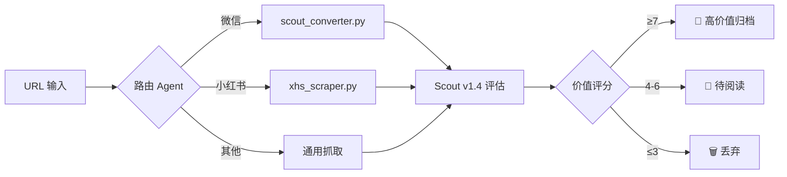

# ExoBuffer 开发规范 (LeanSpec v0.8)

> **角色**: ExoMind "侦察兵前哨站" 的产品设计师与工程师。
> **使命**: 构建多 Agent 编排系统，实现"只让真理通过"的信息过滤。

---

## 1. ❗Problem（问题）

当前开发痛点（基于 2026-01-09 日记）：

**失败链条**:
```
多个 Agent 在黑框运行 → 无标题无状态 → 无完成提示音 → 用户无法掌握全局 → 切换窗口疲劳 → 效率低下
```

**根本问题**:
- 📱 **黑盒终端**: 多个 `cmd` 窗口同时运行不同 Agent，无法一眼识别任务状态
- 🔕 **无提示机制**: 任务完成时无声音提示，需要人工轮询检查
- 📥 **信息入口分散**: 微信/小红书/剪贴板各自为战，无统一缓冲区
- 🧠 **上下文断层**: Scout Agent v1.3 已验证，但未与日常工作流打通

**当前状态**:
- ✅ Scout Agent v1.3 协议固化（15+ 案例验证）
- ✅ `scout_converter.py` (V3) 实现 URL→Markdown
- ✅ `xhs-scraper` 实现小红书图文采集
- ❌ 无统一的 Agent 任务管理界面
- ❌ 无 Android 端分享捕获能力

---

## 2. 🧩 What（是什么）

ExoBuffer 是 **ExoMind 生态的"侦察兵前哨站"**：

```
┌─────────────────────────────────────────────────────────────┐
│                    ExoBuffer 系统架构                        │
├─────────────────────────────────────────────────────────────┤
│                                                             │
│  ┌─────────────┐    ┌─────────────┐    ┌─────────────┐     │
│  │  Android    │    │  Windows    │    │  浏览器扩展  │     │
│  │  分享接收   │───▶│  任务控制台  │◀───│  (Phase 3)  │     │
│  └─────────────┘    └──────┬──────┘    └─────────────┘     │
│                            │                                │
│                    ┌───────▼───────┐                        │
│                    │   Scout Loop   │                        │
│                    │  ┌───────────┐ │                        │
│                    │  │ 路由 Agent │ │                        │
│                    │  └─────┬─────┘ │                        │
│                    │        ▼       │                        │
│                    │  ┌───────────┐ │                        │
│                    │  │ 提取 Agent │ │                        │
│                    │  └─────┬─────┘ │                        │
│                    │        ▼       │                        │
│                    │  ┌───────────┐ │                        │
│                    │  │ Scout v1.4 │ │                        │
│                    │  └───────────┘ │                        │
│                    └───────┬───────┘                        │
│                            ▼                                │
│                    ┌───────────────┐                        │
│                    │ Obsidian Vault │                        │
│                    │  (知识归档)    │                        │
│                    └───────────────┘                        │
└─────────────────────────────────────────────────────────────┘
```

**核心定位**: 不是独立应用，而是 ExoMind 工作流的 **"信息入口 + Agent 调度器"**。

---

## 3. 🎯 Goal（目标）

### 阶段 1 MVP（3-5 天）成功标志：

| 维度 | 目标 | 验证方法 |
|------|------|----------|
| ⚡ **任务可视** | 所有 Agent 任务在一个界面显示 | 同时运行 3 个 Agent，状态清晰可见 |
| 🔊 **完成提示** | 任务完成播放提示音 | 听到 "叮" 声后 3 秒内知道哪个任务完成 |
| 📱 **移动捕获** | Android 可分享 URL 到系统 | 从微信分享一篇文章，桌面端收到 |
| 📊 **价值评估** | Scout v1.4 自动评分 | 3 篇文章评估准确率 > 70% |

### 非目标（明确不做）：

- ❌ 实现 ExoMind 完整 6 环节工作流（仅第一环节）
- ❌ 支持知乎/小红书批量抓取（仅验证单条链接）
- ❌ 复杂的多端同步（先做单向推送）
- ❌ 浏览器扩展（Phase 3 再做）

---

## 4. ✅ In-scope（做什么）

### 4.1. 🖥️ 任务控制中心（Windows Tauri v2）

**核心功能**:

| 功能 | 描述 | 技术实现 |
|------|------|----------|
| **进程卡片** | 每个 Agent 一张卡片，显示名称、状态、运行时长 | React 组件 + Tauri IPC |
| **实时日志** | 流式输出 stdout/stderr | Rust `Command` + WebSocket |
| **声音 Hook** | 任务完成播放 `.wav` | `rodio` 或 Web Audio API |
| **快捷操作** | 启动/停止/重启 Agent | Tauri Command |

**UI 设计**（深色玻璃拟态风格）:
```
┌───────────────────────────────────────────────────────────┐
│  ExoBuffer 任务控制中心                          ─ □ ✕   │
├───────────────────────────────────────────────────────────┤
│                                                           │
│  ┌─ scout_converter ──────────────────────────────────┐  │
│  │ ✅ 已完成 | 耗时 12s | 2026-01-09 20:45:32         │  │
│  │ > 处理完成: 案例-016-Claude Code CLI 2.1.md        │  │
│  │ [查看输出] [重新运行]                              │  │
│  └────────────────────────────────────────────────────┘  │
│                                                           │
│  ┌─ xhs_scraper ──────────────────────────────────────┐  │
│  │ ⏳ 运行中 | 已运行 45s                              │  │
│  │ > 正在加载页面: xiaohongshu.com/discovery/...      │  │
│  │ [查看日志] [停止]                                  │  │
│  └────────────────────────────────────────────────────┘  │
│                                                           │
│  ┌─ 待处理队列 ───────────────────────────────────────┐  │
│  │ 📥 3 个链接等待评估                                │  │
│  │ • https://mp.weixin.qq.com/s/xxx (微信)           │  │
│  │ • https://www.xiaohongshu.com/... (小红书)        │  │
│  │ [批量处理] [清空队列]                              │  │
│  └────────────────────────────────────────────────────┘  │
│                                                           │
│  [+ 新建任务]                         [⚙️ 设置]         │
└───────────────────────────────────────────────────────────┘
```

**技术栈**:
```toml
# Cargo.toml (Tauri 核心依赖)
[dependencies]
tauri = { version = "2.0", features = ["shell-all"] }
tauri-plugin-sql = { version = "2.0", features = ["sqlite"] }
tokio = { version = "1", features = ["process", "io-util"] }
serde = { version = "1", features = ["derive"] }
serde_json = "1"
```

```json
// package.json (前端依赖)
{
  "dependencies": {
    "react": "^18.2.0",
    "react-dom": "^18.2.0",
    "@tauri-apps/api": "^2.0.0"
  },
  "devDependencies": {
    "tailwindcss": "^3.4.0",
    "typescript": "^5.0.0",
    "vite": "^5.0.0"
  }
}
```

### 4.2. 📱 Android 分享接收器（Tauri v2 Mobile）

**核心功能**:

| 功能 | 描述 | 技术实现 |
|------|------|----------|
| **Intent 接收** | 接收系统分享的 URL/文本 | `tauri-plugin-sharetarget` |
| **本地缓存** | 离线时暂存，上线后同步 | SQLite |
| **推送到桌面** | 通过 LAN/云盘同步 | HTTP POST / 文件同步 |

**Android Manifest 配置**:
```xml
<intent-filter>
    <action android:name="android.intent.action.SEND" />
    <category android:name="android.intent.category.DEFAULT" />
    <data android:mimeType="text/plain" />
</intent-filter>
```

### 4.3. 🔄 Scout Loop 自动化

**处理流水线**:



**Scout v1.4 评估协议** (已固化):
```json
{
  "value_score": 8,
  "value_reasoning": "对齐当前个人成长目标",
  "next_action": "DEEP_READ_AND_REFLECT",
  "confidence": 0.90,
  "resource_matrix": [
    {"type": "github", "url": "https://github.com/...", "name": "工具名"}
  ],
  "bias_alert": {
    "detected": false,
    "reason": null
  }
}
```

### 4.4. 🔊 声音 Hook 系统

**实现方案**:
```rust
// src-tauri/src/hooks.rs
use std::process::Command;

pub fn play_completion_sound() {
    // Windows 系统声音
    #[cfg(target_os = "windows")]
    {
        Command::new("powershell")
            .args(["-c", "[console]::beep(800, 200); [console]::beep(1000, 200)"])
            .spawn()
            .ok();
    }
}
```

**Hook 触发时机**:
- ✅ Agent 任务完成
- ⚠️ Agent 任务失败
- 🔔 需要人工权限确认

---

## 5. 🚫 Non-goals（不做什么）

| 不做 | 原因 | 替代方案 |
|------|------|----------|
| 完整知识库搜索 | Obsidian 已有 | 链接到 Obsidian |
| 多用户协作 | 单用户场景 | - |
| 复杂 AI 对话 | 专注信息过滤 | 用 Claude Code |
| 实时双向同步 | 复杂度高 | 先做单向推送 |
| 浏览器扩展 | Phase 3 | 先用复制粘贴 |

---

## 6. ✅ Success Criteria（成功判据）

### MVP 验收标准（必达）:

| # | 标准 | 验证方法 | 通过条件 |
|---|------|----------|----------|
| 1 | 任务可视化 | 同时运行 3 个 Agent | 状态清晰可辨 |
| 2 | 完成提示音 | 任务完成后 | 3 秒内听到声音 |
| 3 | 日志流式输出 | 查看运行中任务 | 实时更新无卡顿 |
| 4 | Android 分享 | 从微信分享文章 | 桌面端 5 秒内收到 |
| 5 | Scout 评估 | 处理 3 篇真实文章 | 准确率 > 70% |

### 用户体验指标:

- ⚡ **启动速度**: 应用启动 < 3 秒
- 🔄 **响应延迟**: 按钮点击反馈 < 100ms
- 🛡️ **容错能力**: Agent 崩溃不影响整体界面

---

## 7. ⚠️ Risks（风险）

| 风险 | 概率 | 影响 | 缓解方案 |
|------|------|------|----------|
| **Tauri v2 Android 不成熟** | 中 | 高 | Day 1 先验证 Intent 接收，失败则切 React Native |
| **Python 脚本集成困难** | 低 | 中 | 已有 `scout_converter.py` 验证，直接复用 |
| **进程管理复杂** | 中 | 中 | 使用 Tokio 异步，参考 `tauri-plugin-shell` |
| **多端同步丢数据** | 低 | 高 | 先做文件同步，不做实时数据库同步 |

---

## 8. ➡️ Next Step（下一步）

### 立即执行（Day 1）:

```bash
# 1. 创建项目目录
mkdir -p d:/Dev/exobuffer-app
cd d:/Dev/exobuffer-app

# 2. 初始化 Tauri v2 项目
npm create tauri-app@latest . -- --template react-ts

# 3. 添加 Android 支持
npx tauri android init

# 4. 安装依赖
cd src-tauri
cargo add tauri-plugin-sql --features sqlite
cargo add tokio --features process,io-util
```

### 关键里程碑:

| 天数 | 里程碑 | 交付物 |
|------|--------|--------|
| Day 1 | Tauri 项目初始化 | 可运行的空壳应用 |
| Day 2 | 进程卡片 UI | 可显示 Agent 状态的界面 |
| Day 3 | 实时日志 + 声音 Hook | 完整的任务监控体验 |
| Day 4 | Android 分享接收 | 移动端到桌面端链路 |
| Day 5 | Scout Loop 集成 | 端到端自动评估 |

---

## 9. 📂 Critical Files（关键文件）

### 现有文件（复用）:
| 文件 | 用途 |
|------|------|
| `scout_converter.py` | 微信公众号 → Markdown |
| `xhs-scraper/xhs_collector.py` | 小红书图文采集 |
| `Scout测试案例/Scout-Agent-v1.3-提示词.md` | Scout 评估协议 |

### 新建文件:
```
d:/Dev/exobuffer-app/
├── src-tauri/
│   ├── src/
│   │   ├── main.rs              # Tauri 入口
│   │   ├── commands.rs          # Tauri 命令
│   │   ├── process_manager.rs   # Agent 进程管理
│   │   └── hooks.rs             # 声音 Hook
│   └── Cargo.toml
├── src/
│   ├── App.tsx                  # 主应用
│   ├── components/
│   │   ├── ProcessCard.tsx      # 进程卡片
│   │   ├── LogViewer.tsx        # 日志查看器
│   │   └── QueuePanel.tsx       # 待处理队列
│   └── styles/
│       └── globals.css          # TailwindCSS
└── package.json
```

---

## 10. 🔍 Verification（验证方法）

### 端到端测试流程:

1. **准备**: 启动 ExoBuffer 桌面端
2. **捕获**: 从微信分享一篇文章到 Android 端
3. **同步**: 确认桌面端收到链接
4. **评估**: 点击运行 Scout 评估
5. **监控**: 观察进程卡片状态变化
6. **提示**: 任务完成时听到提示音
7. **结果**: 查看 Scout 评分和归档位置

---

**文档版本**: v0.8 (LeanSpec)
**创建时间**: 2026-01-09 20:55
**状态**: 待用户审核
