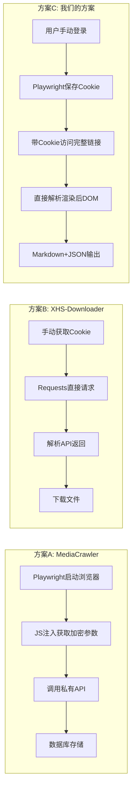
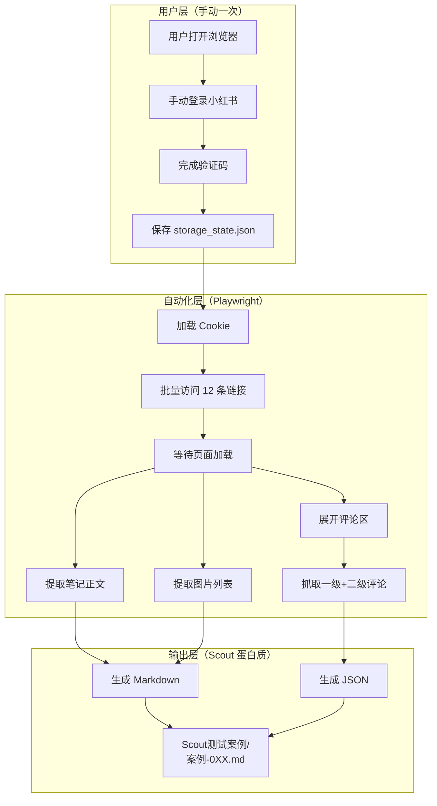

# 小红书采集器 Playwright 方案 V2

> **理念**: 夺取用户在信息时代的主权 - ExoBuffer 外部缓冲区
> **原则**: 尊重平台规则，用户自主登录，我们只做「价值过滤膜」

---

## 1. 竞品技术方案对比

### 1.1. 三大开源项目分析

| 项目 | 核心技术 | 登录方式 | 评论采集 | 优势 | 劣势 |
|------|----------|----------|----------|------|------|
| **MediaCrawler** | Playwright + JS注入 | 二维码/手机/Cookie | ✅ 支持 | 多平台、代码规范、企业级 | 配置复杂 |
| **XHS-Downloader** | Requests + API | Cookie | ❌ 仅下载 | 轻量、无水印、API模式 | 无评论、依赖逆向 |
| **xhs SDK** | Playwright + JS文件 | Playwright | ✅ 支持 | SDK封装好用 | 需下载JS绕过加密 |

### 1.2. 技术路线对比



### 1.3. 我们方案的差异化

| 维度 | 竞品做法 | 我们的做法 | 原因 |
|------|----------|------------|------|
| **加密绕过** | JS逆向/注入 | 不绕过，用原始链接 | 尊重平台 |
| **登录** | 自动化处理 | 用户手动 | 合规 |
| **数据解析** | API返回JSON | DOM直接提取 | 更稳定 |
| **输出格式** | CSV/数据库 | Markdown+JSON | 集成Scout |

---

## 2. 需求确认

| 项目 | 决策 |
|------|------|
| 方案 | ✅ Playwright 全自动化 |
| 登录 | ✅ 用户手动登录一次，保存 Cookie |
| 验证码 | ✅ 用户自行处理，脚本不绕过 |
| 评论深度 | ✅ 包含二级回复 |
| 输出格式 | ✅ Markdown + JSON 元数据 |
| 存储位置 | ✅ `Scout测试案例/` → 后期迁移 `00-Inbox/` |

---

## 3. 技术架构



---

## 4. 核心模块设计

### 4.1. 登录与会话管理（已验证）

> [!NOTE]
> 使用 `launch_persistent_context` 替代 `storage_state`，登录状态自动持久化！

```python
# xhs_login.py - 使用独立 Profile 目录（已验证成功）
from playwright.sync_api import sync_playwright
import os

PLAYWRIGHT_PROFILE = r"D:\Obsidian Vault\10-Projects\ExoMind\ExoBuffer\playwright_profile"

def login_and_save():
    with sync_playwright() as p:
        # 关键：使用独立 Profile 目录，登录状态自动保存
        context = p.chromium.launch_persistent_context(
            user_data_dir=PLAYWRIGHT_PROFILE,
            headless=False,              # 首次需可视化登录
            slow_mo=500,
            viewport={"width": 1280, "height": 900},
            args=["--disable-blink-features=AutomationControlled"]
        )
        
        page = context.pages[0] if context.pages else context.new_page()
        page.goto("https://www.xiaohongshu.com")
        
        print("请在浏览器中手动登录小红书（微信扫码）...")
        print("登录完成后，按回车保存会话...")
        input()
        
        print(f"✅ 登录状态已保存至: {PLAYWRIGHT_PROFILE}")
        context.close()
```

**Profile 存储位置**: `ExoBuffer/playwright_profile/`
- 首次运行需手动登录（微信扫码）
- 后续运行自动复用登录状态

### 4.2. 笔记采集模块 (`xhs_collector.py`)

```python
from playwright.sync_api import sync_playwright
import json
import time
from pathlib import Path

AUTH_FILE = "xhs_auth.json"
OUTPUT_DIR = Path("Scout测试案例")

def collect_note(page, url: str) -> dict:
    """采集单条笔记"""
    page.goto(url)
    page.wait_for_load_state("networkidle")
    time.sleep(2)  # 等待动态内容
    
    note = {
        "url": url,
        "title": "",
        "content": "",
        "images": [],
        "comments": []
    }
    
    # 提取标题
    title_el = page.query_selector('div.note-top-text, .title')
    if title_el:
        note["title"] = title_el.inner_text()
    
    # 提取正文
    content_el = page.query_selector('div.desc, .note-content')
    if content_el:
        note["content"] = content_el.inner_text()
    
    # 提取图片
    for img in page.query_selector_all('div.swiper-slide img'):
        src = img.get_attribute('src') or img.get_attribute('data-src')
        if src:
            note["images"].append(src)
    
    # 展开并抓取评论
    note["comments"] = collect_comments(page)
    
    return note

def collect_comments(page) -> list:
    """采集评论（含二级）"""
    comments = []
    
    # 点击展开更多评论
    while True:
        expand_btn = page.query_selector('text=展开更多')
        if expand_btn:
            expand_btn.click()
            time.sleep(1)
        else:
            break
    
    # 提取一级评论
    for comment_el in page.query_selector_all('.comment-item'):
        comment = {
            "user": "",
            "content": "",
            "replies": []
        }
        
        user_el = comment_el.query_selector('.user-name')
        if user_el:
            comment["user"] = user_el.inner_text()
            
        content_el = comment_el.query_selector('.content')
        if content_el:
            comment["content"] = content_el.inner_text()
        
        # 提取二级回复
        for reply_el in comment_el.query_selector_all('.reply-item'):
            reply = {}
            reply_user = reply_el.query_selector('.user-name')
            reply_content = reply_el.query_selector('.content')
            if reply_user:
                reply["user"] = reply_user.inner_text()
            if reply_content:
                reply["content"] = reply_content.inner_text()
            comment["replies"].append(reply)
        
        comments.append(comment)
    
    return comments
```

### 4.3. 输出模块 (`xhs_output.py`)

```python
def save_to_markdown(note: dict, case_id: str, output_dir: Path):
    """输出 Markdown + JSON 格式"""
    
    # 构造 Markdown
    md_content = f"""# {case_id}: {note['title']}

> [!SUMMARY]
> **来源**: 小红书
> **链接**: {note['url']}
> **采集时间**: {datetime.now().isoformat()}
> **格式**: Markdown + JSON (Scout V4)

---

## 正文

{note['content']}

## 图片

"""
    for i, img_url in enumerate(note['images'], 1):
        md_content += f"\n\n"
    
    md_content += """
## 评论区

"""
    for c in note['comments']:
        md_content += f"**{c['user']}**: {c['content']}\n"
        for r in c.get('replies', []):
            md_content += f"  └ **{r['user']}**: {r['content']}\n"
        md_content += "\n"
    
    # 保存 Markdown
    md_path = output_dir / f"{case_id}.md"
    md_path.write_text(md_content, encoding='utf-8')
    
    # 保存 JSON 元数据
    json_path = output_dir / f"{case_id}.json"
    json_path.write_text(json.dumps(note, ensure_ascii=False, indent=2))
    
    print(f"✅ 已保存: {md_path}")
```

### 4.4. 图片下载 + MCP 图文理解（核心模块）

> [!IMPORTANT]
> **核心资源 = 原始图片 + 文字内容 + 评论**
> 不是整页截图，而是下载笔记中的每张图片后逐张理解！

```python
import httpx
from pathlib import Path

def download_images(page, note_id: str, output_dir: Path) -> list:
    """下载笔记中的所有原始图片"""
    images = []
    img_dir = output_dir / note_id / "images"
    img_dir.mkdir(parents=True, exist_ok=True)
    
    # 提取所有图片 URL（优先 data-src 高清源）
    for i, img in enumerate(page.query_selector_all('div.swiper-slide img, .note-image img'), 1):
        src = img.get_attribute('data-src') or img.get_attribute('src')
        if not src:
            continue
        
        # 下载图片
        try:
            r = httpx.get(src, timeout=30)
            img_path = img_dir / f"img_{i:02d}.jpg"
            img_path.write_bytes(r.content)
            images.append(str(img_path))
            print(f"  ✅ 下载图片 {i}: {img_path.name}")
        except Exception as e:
            print(f"  ❌ 下载失败: {e}")
    
    return images

def understand_images_with_mcp(image_paths: list) -> list:
    """调用 MCP 逐张理解图片内容"""
    results = []
    for img_path in image_paths:
        # 调用 MCP understand_image
        # mcp__MiniMax__understand_image(
        #     image_source=img_path,
        #     prompt="描述这张图片的内容，提取关键信息、代码、工具名称等"
        # )
        results.append({"path": img_path, "content": "..."})
    return results
```

### 4.5. 完整采集流程

```python
def collect_note_full(page, url: str, output_dir: Path) -> dict:
    """完整采集：文字 + 图片 + 评论"""
    page.goto(url, wait_until="networkidle", timeout=60000)
    time.sleep(5)
    
    note_id = extract_note_id(url)
    
    # 1. 提取文字内容
    title = page.query_selector('.title, .note-top-text')
    content = page.query_selector('.desc, .note-content')
    
    note = {
        "id": note_id,
        "url": url,
        "title": title.inner_text() if title else "",
        "content": content.inner_text() if content else "",
        "images": [],
        "image_analysis": [],
        "comments": []
    }
    
    # 2. 下载原始图片
    note["images"] = download_images(page, note_id, output_dir)
    
    # 3. MCP 理解每张图片
    note["image_analysis"] = understand_images_with_mcp(note["images"])
    
    # 4. 提取评论（含二级）
    note["comments"] = collect_comments(page)
    
    # 5. 保存整页截图（备份）
    screenshot_path = output_dir / note_id / "page_backup.png"
    page.screenshot(path=str(screenshot_path), full_page=True)
    
    return note
```

### 4.6. 输出目录结构与命名规范

> [!NOTE]
> 文件名格式：`案例-{编号}-{标题简称}`

```
Scout测试案例/
├── 案例-014-Claude_Code_CLI更新/
│   ├── 案例-014-Claude_Code_CLI更新.md
│   ├── 案例-014-Claude_Code_CLI更新.json
│   ├── images/
│   │   ├── img_01.jpg
│   │   ├── img_02.jpg
│   │   └── ...
│   └── page_backup.png
└── ...
```

```python
def sanitize_title(title: str, max_len: int = 20) -> str:
    """标题简化：去特殊字符，截断"""
    import re
    clean = re.sub(r'[\\/*?:"<>|]', '', title)
    clean = clean.replace(' ', '_')[:max_len]
    return clean

# 使用示例
case_name = f"案例-{case_id:03d}-{sanitize_title(note['title'])}"
```

---

## 5. 与 Scout 蛋白质集成

```
scout_converter.py (微信公众号) 
       ↓
xhs_collector.py (小红书) ← 新增
       ↓
统一输出格式: Scout测试案例/案例-0XX.md
       ↓
Scout Agent v1.3 评估
```

---

## 6. 文件结构

```
ExoBuffer/
├── scout_converter.py       # 微信公众号蛋白质 (已有)
├── xhs_login.py             # [新增] 用户登录保存 Cookie
├── xhs_collector.py         # [新增] 笔记采集核心
├── xhs_output.py            # [新增] Markdown+JSON 输出
├── xhs_auth.json            # [运行时生成] 用户 Cookie
└── Scout测试案例/
    ├── 案例-014.md          # 小红书采集结果
    ├── 案例-014.json        # 元数据
    └── ...
```

---

## 7. 使用流程

```bash
# 1. 首次登录（仅需一次）
python xhs_login.py
# → 在浏览器中手动登录，完成验证码
# → 回车保存 Cookie

# 2. 批量采集
python xhs_collector.py --urls urls.txt
# → 读取 xhs_auth.json
# → 自动采集 12 条小红书链接
# → 输出到 Scout测试案例/
```

---

## 8. 验证计划

- [ ] **Step 1**: 实现 `xhs_login.py`，验证 Cookie 保存
- [ ] **Step 2**: 测试 1 条链接采集（正文+图片）
- [ ] **Step 3**: 测试评论区展开+二级回复
- [ ] **Step 4**: 批量采集 12 条链接
- [ ] **Step 5**: 输出格式与 Scout 案例对齐

---

## 9. 反爬对策

> [!IMPORTANT]
> **顺序访问原则**：采集过程**严禁并发/并行**访问多个页面！
> 必须模拟真实用户行为：看完一个帖子 → 等待 → 再打开下一个帖子。

| 挑战 | 应对方式 |
|------|----------|
| 登录验证码 | 用户手动处理（尊重平台） |
| Cookie 过期 | 重新运行 `xhs_login.py` |
| 请求频率限制 | **顺序访问 + 随机延迟 5-15 秒** |
| 页面结构变化 | CSS 选择器可配置化 |

### 9.1. 访问策略代码

```python
import random
import time

def batch_collect(urls: list):
    """顺序采集，模拟真实用户"""
    for i, url in enumerate(urls, 1):
        print(f"[{i}/{len(urls)}] 正在采集: {url}")
        
        # 采集当前笔记
        note = collect_note(page, url)
        save_to_markdown(note, f"案例-{i:03d}", OUTPUT_DIR)
        
        # 模拟用户阅读时间（5-15秒随机延迟）
        if i < len(urls):
            delay = random.uniform(5, 15)
            print(f"    等待 {delay:.1f} 秒后继续...")
            time.sleep(delay)
    
    print("✅ 全部采集完成")
```

### 9.2. 为什么必须顺序访问？

```
❌ 错误做法（并发）：
   同时打开 12 个页面 → 触发风控 → 账号被限制

✅ 正确做法（顺序）：
   第1篇 → 等5秒 → 第2篇 → 等8秒 → ... → 第12篇
   模拟真实用户浏览行为 → 安全
```
