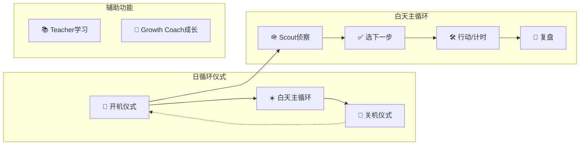

# ExoMind 需求规格说明书

> 第1部分：概述 + 背景 + 用户故事
> 参考：`架构设计-20260120.md` | `【人写】外心项目团队整体文档.md`

---

## 1. 文档概述

### 1.1 目的

将系统架构翻译为**用户可感知的功能需求**，为UI设计提供依据。

### 1.2 适用范围

| 平台             | 覆盖范围  |
| -------------- | ----- |
| Android App    | 完整功能  |
| PC App (Tauri) | 完整功能  |
| Web App        | 完整功能  |
| CLI/TUI        | 服务器场景 |

### 1.3 参考架构层级

```
┌─────────────────────────────────────────────────────────┐
│ 第7层：UI层        (apps/*/ui/ + core/ui/)              │
│ 第6层：业务层      (core/business/ + apps/*/business/)  │
│ 第5层：事件总线    (core/event-bus/)                     │
│ 第4层：数据层      (core/data/blockchain/)              │
│ 第3层：同步引擎    (core/sync/)                          │
│ 第2层：存储层      (SQLite/IndexedDB)                   │
│ 第1层：网络层      (core/network/)                       │
└─────────────────────────────────────────────────────────┘
```

---

## 2. 产品背景与愿景

### 2.1 问题背景

**用户痛点链条**：

```
信息过载 → 判断变慢 → 启动困难 → 上下文丢失 → 复盘不沉淀 → 每次像第一次
```

**根因分析**：

| 层级   | 表现         | 问题     |
| ---- | ---------- | ------ |
| 意识层  | 目标、计划、价值观  | 知道但做不到 |
| 潜意识层 | 焦虑、回避、完美主义 | 被旧模式拖回 |
| 系统层  | 节律崩溃、手机劫持  | 能量持续耗尽 |

### 2.2 产品愿景

**定位**：外心 = 外骨骼 / 新器官 /个人成长助手，生命成长助手

- **AI驱动**：侦察、整理、提示、校准、减摩擦
- **人类主导**：价值选择、目标设定、最终决策由用户负责
- **生命成长**：目标不是效率最大化，而是更稳、更自由、更可持续

### 2.3 目标用户画像

| 维度  | 描述                  |
| --- | ------------------- |
| 身份  | hailay（计算机本科学生，开发者） |
| 场景  | 学习、科研、开发、个人成长       |
| 痛点  | 信息过载、启动困难、复盘不沉淀     |
| 需求  | 本地优先、隐私保护、跨端同步      |

---

## 3. 用户故事与场景

### 3.1 用户角色定义

```
┌─────────────────────────────────────────────────────────────────┐
│                        hailay 的心智结构                          │
├─────────────────────────────────────────────────────────────────┤
│                                                                 │
│  意识层（Conscious）                                            │
│  ┌─────────────────────────────────────────────────────────┐   │
│  │ 目标、计划、价值观、显式信念、策略                       │   │
│  └─────────────────────────────────────────────────────────┘   │
│                              ↓                                  │
│  潜意识层（Unconscious）                                        │
│  ┌─────────────────────────────────────────────────────────┐   │
│  │ 安全感/自由感/价值感/亲密感的缺口                        │   │
│  │ 触发器、习惯回路、防御机制、默认叙事                     │   │
│  └─────────────────────────────────────────────────────────┘   │
│                                                                 │
└─────────────────────────────────────────────────────────────────┘
```

### 3.2 核心闭环协议

```
目标设定 → 觉察 → 行动（Session/TimeBlock）→ 反馈 → 巩固
```

### 3.3 核心用户故事 (P0)

#### US-01：开机仪式

| 要素   | 内容                                                                                        |
| ---- | ----------------------------------------------------------------------------------------- |
| 标题   | 晨间启动：清晰今天的自己                                                                              |
| 角色   | hailay（意识层启动中）                                                                            |
| 场景   | 睡醒后，打开外心系统                                                                                |
| 触发   | 用户打开应用                                                                                    |
| 期望输出 | 1. 心智结构复习（身份方向）<br>2. 睡醒心语（状态自评）<br>3. 晨间学习（少量复习+检测）<br>4. 真实鼓励（事实支撑）<br>5. Governor定今日模式 |
| 时长   | 5-10分钟内完成                                                                                 |
| 原则   | 默认短、默认可跳过、失败不羞辱                                                                           |

#### US-02：外部信息侦察（Scout）

| 要素   | 内容                                                                |
| ---- | ----------------------------------------------------------------- |
| 标题   | 信息分诊：值不值得注意                                                       |
| 角色   | hailay（面对信息洪流）                                                    |
| 场景   | 收到/刷到新信息（文章、消息、录音）                                                |
| 触发   | 新信息进入外部缓冲区                                                        |
| 期望输出 | 1. 这条信息对我当前目标有什么用？<br>2. 下一步做什么？（只给1步）<br>3. 我是否需要亲自看原文？（理由+预估投入） |
| 原则   | 渐进式呈现、先给关键判断、细节按需展开                                               |

#### US-03：时间块行动

| 要素   | 内容                                                                                           |
| ---- | -------------------------------------------------------------------------------------------- |
| 标题   | 专注执行：25分钟一个闭环                                                                                |
| 角色   | hailay（进入行动状态）                                                                               |
| 场景   | 开始一个任务/学习/工作                                                                                 |
| 触发   | 用户开始计时                                                                                       |
| 期望输出 | 1. 任务名称输入<br>2. 正计时/倒计时选择<br>3. 计时进行中（状态栏显示）<br>4. 完成/中断<br>5. 能量评分（1-10）<br>6. 自动生成EventLog |
| 原则   | 操作不超过10秒、允许随时中断、失败不羞辱                                                                        |

#### US-04：复盘反馈（Review）

| 要素   | 内容                                                    |
| ---- | ----------------------------------------------------- |
| 标题   | 极简复盘：下次能做得更好                                          |
| 角色   | hailay（行动后沉淀）                                         |
| 场景   | 完成一个时间块/一天结束                                          |
| 触发   | 时间块结束 / 手动触发                                          |
| 期望输出 | 四行复盘：<br>✅ 哪里有效<br>🧱 哪里卡住<br>🔧 下次改一条策略<br>🚫 避免一条做法 |
| 原则   | 不写作文、只改一条、可拒绝                                         |

#### US-05：关机仪式

| 要素 | 内容 |
|------|------|
| 标题 | 睡前收尾：降低唤醒度 |
| 角色 | hailay（准备入睡） |
| 场景 | 一天结束，准备睡觉 |
| 触发 | 手动进入关机模式 |
| 期望输出 | 1. 今日复盘（下次方案1条+避免项1条）<br>2. 成长洞见+练习各1条（可拒绝）<br>3. 睡前复习少量<br>4. 手机边界提醒（温和）<br>5. 放松1个动作<br>6. Governor校准明天 |
| 时长 | 10分钟内完成 |
| 原则 | 失败不羞辱、默认短、可跳过 |

### 3.4 用户故事地图



---

## 4. 边缘场景与异常处理

| 场景   | 处理方式            |
| ---- | --------------- |
| 中断计时 | 记录中断原因、可恢复上下文   |
| 跳过仪式 | 默认可跳过、不羞辱       |
| 同步冲突 | 按时间戳+设备ID合并、只追加 |
| 网络离线 | 离线优先、本地存储、联网后同步 |

---

## 5. 待确认问题

1. 开机仪式的5个步骤，哪些是**必须**、哪些是**可选**？
2. Scout侦察的信息来源有哪些？（微信/浏览器/Obsidian/其他）
3. 复盘是否需要与Obsidian日记联动？

---

*文档版本：1.0 | 最后更新：2026-01-20 | 关联文档：架构设计-20260120.md*
