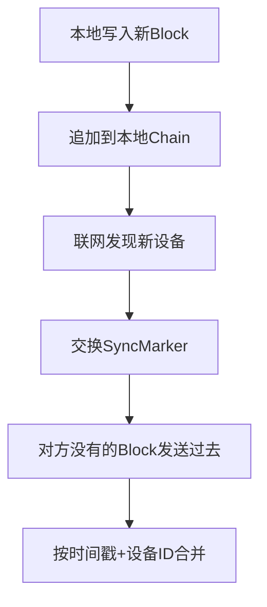
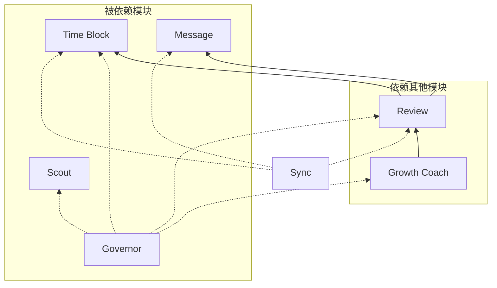

# ExoMind 需求规格说明书

> 第2部分：功能需求规格（P0功能模块）
> 前置：SRS-01

---

## 1. 功能模块总览

```
┌─────────────────────────────────────────────────────────────────────────┐
│                          ExoMind 功能模块                                │
├─────────────────────────────────────────────────────────────────────────┤
│                                                                         │
│  ┌─────────────┐  ┌─────────────┐  ┌─────────────┐  ┌─────────────┐   │
│  │   Governor  │  │    Scout    │  │ Time Block  │  │   Review    │   │
│  │  系统调控    │  │   侦察兵    │  │   时间块    │  │   复盘      │   │
│  └─────────────┘  └─────────────┘  └─────────────┘  └─────────────┘   │
│         │                │                │                │            │
│  ┌─────────────┐  ┌─────────────┐  ┌─────────────┐  ┌─────────────┐   │
│  │Growth Coach │  │   Teacher   │  │   Message   │  │    Sync     │   │
│  │  成长教练    │  │   学习助手   │  │   消息      │  │   同步      │   │
│  └─────────────┘  └─────────────┘  └─────────────┘  └─────────────┘   │
│                                                                         │
└─────────────────────────────────────────────────────────────────────────┘
```

---

## 2. 功能模块规格

### 2.1 Governor（系统调控）

| 属性  | 值               |
| --- | --------------- |
| 优先级 | P0              |
| 层级  | 第6层：业务层         |
| 职责  | 系统调度、节奏控制、副作用治理 |

**功能清单**：

| 功能ID | 功能名称 | 描述 | 输入 | 输出 |
|--------|----------|------|------|------|
| G-01 | 开机调度 | 根据今日状态选择模式 | 睡醒心语结果 | 推进/修复/学习/校准模式 |
| G-02 | 输出治理 | 拦截/降级副作用 | 系统输出 | 降级后的输出 |
| G-03 | 关机校准 | 总结今天建议有效性 | Review结果 | 明天收缩/调整建议 |
| G-04 | 防膨胀 | 保持主循环极简 | 系统负载 | 精简建议 |

**交互方式**：作为后台服务，通过事件总线调度其他模块。

---

### 2.2 Scout（侦察兵）

| 属性 | 值 |
|------|-----|
| 优先级 | P0 |
| 层级 | 第6层：业务层 |
| 职责 | 信息侦察、目标对齐、风险预警 |

**功能清单**：

| 功能ID | 功能名称  | 描述         | 输入        | 输出    |
| ---- | ----- | ---------- | --------- | ----- |
| S-01 | 信息收集  | 从外部缓冲区获取信息 | 缓冲区URL/内容 | 原始信息  |
| S-02 | 目标对齐  | 判断与当前目标相关性 | 信息 + 用户目标 | 相关性评分 |
| S-03 | 最小下一步 | 给出1步可执行建议  | 相关性评分     | 下一步动作 |
| S-04 | 渐进呈现  | 先关键判断、后细节  | 完整分析      | 分级输出  |

**输出格式（强制三问）**：

```yaml
scout_result:
  question_1: "这条信息对我当前目标有什么用？"
  answer_1: "<相关性与判断>"

  question_2: "下一步做什么？"
  answer_2: "<最小下一步（仅1步）>"

  question_3: "是否需要亲自看原文？"
  answer_3:
    need_read: true/false
    reason: "<理由>"
    estimated_time: "<预估投入>"
```

---

### 2.3 Time Block（时间块）

| 属性 | 值 |
|------|-----|
| 优先级 | P0 |
| 层级 | 第6层：业务层 |
| 职责 | 行动组织、专注计时、EventLog生成 |

**功能清单**：

| 功能ID | 功能名称 | 描述 | 输入 | 输出 |
|--------|----------|------|------|------|
| TB-01 | 开始计时 | 启动时间块 | 任务名称、计时模式 | 计时开始 |
| TB-02 | 正计时 | 专注时长记录 | - | 已运行时间 |
| TB-03 | 倒计时 | 番茄钟/自定义时长 | 目标时长 | 倒计时显示 |
| TB-04 | 停止计时 | 结束时间块 | 中断原因（可选） | 计时结束 |
| TB-05 | 能量评分 | 事前/事后能量评估 | 1-10评分 | 能量值 |
| TB-06 | EventLog生成 | 追加事实记录 | 计时数据 | Block写入 |

**EventLog格式**：

```yaml
---
type: time-block
id: evt-YYYYMMDD-NNN
ts: YYYY-MM-DD HH:mm:ss
task_id: "任务名称"
status: completed | interrupted
timer_type: focus | break
duration: 25m
energy_before: 7/10
energy_after: 6/10
---
```

---

### 2.4 Review（复盘反馈）

| 属性 | 值 |
|------|-----|
| 优先级 | P0 |
| 层级 | 第6层：业务层 |
| 职责 | 行动反馈、可复用策略沉淀 |

**功能清单**：

| 功能ID | 功能名称 | 描述 | 输入 | 输出 |
|--------|----------|------|------|------|
| R-01 | 极简复盘 | 四行复盘模板 | 完成的TimeBlock | 复盘结果 |
| R-02 | 下次方案 | 提炼有效策略 | 复盘内容 | 可复用方案 |
| R-03 | 避免项 | 提炼教训 | 复盘内容 | 避免做法 |
| R-04 | 复盘沉淀 | 追加到EventLog | 复盘结果 | Block写入 |

**复盘模板**：

```
✅ 哪里有效：<1条>
🧱 哪里卡住：<1条>
🔧 下次改一条：<1条>
🚫 避免一条：<1条>
```

---

### 2.5 Growth Coach（成长教练）

| 属性 | 值 |
|------|-----|
| 优先级 | P1 |
| 层级 | 第6层：业务层 |
| 职责 | 心智结构升级、潜意识模式识别 |

**功能清单**：

| 功能ID | 功能名称 | 描述 | 输入 | 输出 |
|--------|----------|------|------|------|
| GC-01 | 证据三角 | 行为+感受+叙事分析 | EventLog + 自述 | 证据报告 |
| GC-02 | 模式假设 | 识别触发器/默认模式 | 证据报告 | 假设（语气温和） |
| GC-03 | 最小练习 | 3-5分钟可完成练习 | 模式假设 | 练习建议 |
| GC-04 | 成长总结 | 日终成长洞见 | Review + 练习结果 | 洞见1条 |

**输出原则**：
- 基于证据三角（行为/感受/叙事）
- 用假设语气，不贴标签
- 只给1个练习，可拒绝

---

### 2.6 Message（消息）

| 属性 | 值 |
|------|-----|
| 优先级 | P0 |
| 层级 | 第6层：业务层 |
| 职责 | 消息记录、事实保存 |

**功能清单**：

| 功能ID | 功能名称 | 描述 | 输入 | 输出 |
|--------|----------|------|------|------|
| M-01 | 消息输入 | 记录事件/信息 | 文本/语音 | 消息创建 |
| M-02 | 实时追加 | 追加到EventLog | 消息内容 | Block写入 |
| M-03 | 历史查看 | 查看消息记录 | 筛选条件 | 消息列表 |

**原则**：只追加、不修改、不删除。

---

### 2.7 Sync（同步引擎）

| 属性  | 值           |
| --- | ----------- |
| 优先级 | P0          |
| 层级  | 第3层：同步引擎    |
| 职责  | 多端数据同步、冲突解决 |

**功能清单**：

| 功能ID  | 功能名称  | 描述          | 输入         | 输出         |
| ----- | ----- | ----------- | ---------- | ---------- |
| SY-01 | 局域网发现 | mDNS发现同网设备  | -          | 设备列表       |
| SY-02 | 同步标记  | 记录同步位置      | 对方设备ID     | SyncMarker |
| SY-03 | 数据同步  | 交换缺失Block   | SyncMarker | Block传输    |
| SY-04 | 冲突合并  | 按时间戳+设备ID合并 | 冲突Block    | 合并结果       |
| SY-05 | 按需同步  | 只拉取指定范围     | 同步策略       | 部分数据       |

**同步流程**：



---

## 3. 功能优先级矩阵

| 模块           | P0（必须）         | P1（增强）  | P2（规划） |
| ------------ | -------------- | ------- | ------ |
| Governor     | 开机调度、输出治理      | 防膨胀     | 高级调度   |
| Scout        | 信息收集、目标对齐      | 渐进呈现    | 批量处理   |
| Time Block   | 开始/停止/EventLog | 正/倒计时   | 统计视图   |
| Review       | 四行复盘、沉淀        | 周期汇总    | AI辅助   |
| Growth Coach | -              | 证据三角、练习 | 模式追踪   |
| Message      | 消息输入、实时追加      | 历史查看    | 搜索过滤   |
| Sync         | 局域网发现、数据同步     | 按需同步    | 云端同步   |

---

## 4. 功能依赖关系



---

## 5. 非功能需求

| 类型  | 需求                         |
| --- | -------------------------- |
| 性能  | 计时误差<1秒；UI响应<100ms         |
| 安全  | 数据本地加密；传输加密                |
| 可用性 | 离线可用；断点可恢复                 |
| 存储  | SQLite本地存储；IndexedDB Web存储 |

---

*文档版本：1.0 | 最后更新：2026-01-20 | 前置：SRS-01 | 后续：SRS-03*
