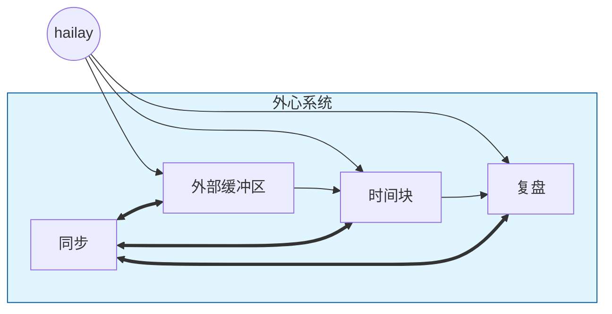
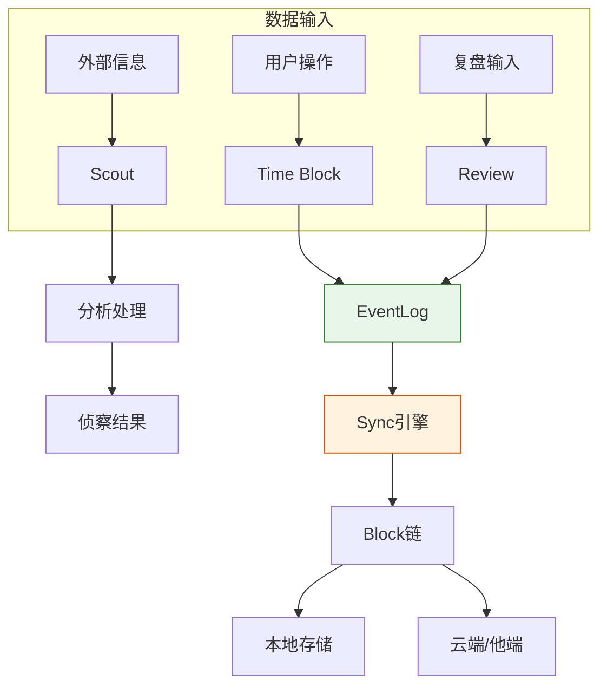
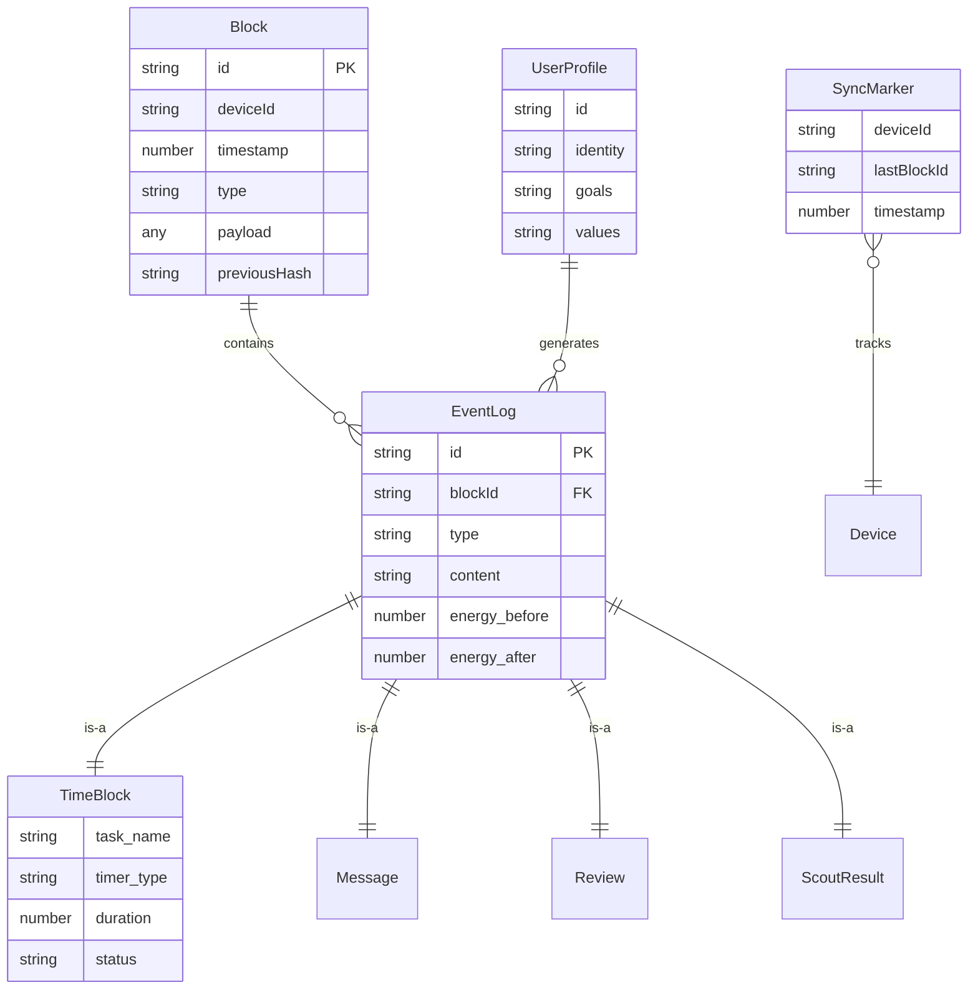

# ExoMind 需求规格说明书

> 第3部分：数据流与信息架构
> 前置：SRS-02

---

## 1. 核心数据流图

### 1.1 一级数据流（上下文图）



### 1.2 二级数据流（细化）



---

## 2. 关键数据实体

### 2.1 实体关系图（核心）



### 2.2 核心实体说明

| 实体              | 说明              | 关键字段                                                 |
| --------------- | --------------- | ---------------------------------------------------- |
| **Block**       | 区块链基本单元，只追加不修改  | id, deviceId, timestamp, type, payload, previousHash |
| **EventLog**    | 事实层：发生过什么的可审计历史 | id, type, content, energy_before/after               |
| **TimeBlock**   | 时间块：可启动的行动闭环    | task_name, timer_type, duration, status              |
| **UserProfile** | 用户心智结构          | identity, goals, values                              |
| **BufferItem**  | 侦察条目：待处理信息      | source, relevance_score, suggested_action            |
| **SyncMarker**  | 同步标记：跨设备同步位置    | deviceId, lastBlockId, timestamp                     |

### 2.3 EventLog 类型枚举

```typescript
type EventType =
  | 'time-block.start'    // 时间块开始
  | 'time-block.end'      // 时间块结束
  | 'time-block.interrupt' // 时间块中断
  | 'message.create'      // 消息创建
  | 'scout.result'        // 侦察结果
  | 'review.create'       // 复盘创建
  | 'review.improvement'  // 改进建议
  | 'growth.practice'     // 成长练习
  | 'sync.merge'          // 同步合并
  | 'system.config'       // 系统配置
```

---

## 3. 数据流与模块交互

### 3.1 开机仪式数据流

```
┌─────────────────────────────────────────────────────────────────────┐
│                        开机仪式数据流                                 │
├─────────────────────────────────────────────────────────────────────┤
│                                                                     │
│  UserProfile ──→ 身份方向显示                                        │
│       │                                                               │
│       ↓                                                               │
│  睡醒心语输入 ──→ 状态评估                                           │
│       │                                                               │
│       ↓                                                               │
│  晨间复习 ──→ Teacher ──→ 检测结果                                   │
│       │                                                               │
│       ↓                                                               │
│  能量评分 ──→ EventLog(time-block.start)                             │
│                                                                     │
└─────────────────────────────────────────────────────────────────────┘
```

### 3.2 Scout数据流

```
┌─────────────────────────────────────────────────────────────────────┐
│                        Scout数据流                                   │
├─────────────────────────────────────────────────────────────────────┤
│                                                                     │
│  外部缓冲区 ──→ 原始信息                                            │
│       │                                                               │
│       ↓                                                               │
│  Scout分析 ──→ 目标对齐                                             │
│       │                                                               │
│       ↓                                                               │
│  输出三问 ──→ 侦察结果                                               │
│       │                                                               │
│       ↓                                                               │
│  EventLog(scout.result)                                             │
│                                                                     │
└─────────────────────────────────────────────────────────────────────┘
```

### 3.3 时间块数据流

```
┌─────────────────────────────────────────────────────────────────────┐
│                        时间块数据流                                  │
├─────────────────────────────────────────────────────────────────────┤
│                                                                     │
│  任务名称 ──→ 计时配置 ──→ 计时器启动                               │
│       │                       │                                      │
│       │                       ↓                                      │
│       │               计时中(状态栏显示)                             │
│       │                       │                                      │
│       │                       ↓                                      │
│       └───────────← 停止/中断 ──→ 能量评分                          │
│                                   │                                  │
│                                   ↓                                  │
│                          EventLog生成                                │
│                                   │                                  │
│                                   ↓                                  │
│                          追加到Block链                               │
│                                                                     │
└─────────────────────────────────────────────────────────────────────┘
```

---

## 4. 数据生命周期

| 阶段 | 操作 | 存储位置 |
|------|------|----------|
| 创建 | 用户输入/系统生成 | 本地SQLite/IndexedDB |
| 追加 | 追加Block到Chain | 本地存储 |
| 同步 | 交换SyncMarker + Block | 局域网/云端 |
| 查询 | 按时间/类型/设备筛选 | 本地/远程 |
| 归档 | 按需同步（可只保留摘要） | 可选云端 |

---

## 5. 同步策略

### 5.1 同步层级

```
Level 1: 本地存储（每端独立）
  ├─ 手环 (SQLite Lite)
  ├─ 手机 (SQLite)
  ├─ Linux (SQLite)
  └─ PC GUI (SQLite)

Level 2: 局域网同步（mDNS/P2P发现）
  └─ 手机 ←→ Linux ←→ GUI

Level 3: 云端同步（可选）
  └─ 所有设备 ←→ 服务器
```

### 5.2 冲突解决规则

| 冲突类型 | 解决方式 |
|----------|----------|
| 同设备同时间同类型 | 覆盖（程序bug，需修复） |
| 不同设备同时间 | 保留，通过deviceId区分 |
| 不同时间 | 按时间戳排序串联 |

---

*文档版本：1.0 | 最后更新：2026-01-20 | 前置：SRS-02 | 后续：SRS-04*
